# 46POS — Smart POS & Inventory System

Полное визуальное README без показа исходного кода: здесь — подробное описание функций, админ-панели, бэкапа и все скриншоты из `assets/screenshots/`.

Коротко: надёжная оффлайн‑касса для малого бизнеса и аптек: продажи, учёт товара, долги, отчёты и печать.

---

## Что внутри (кратко)

- Работает оффлайн полностью: все операции сохраняются локально в SQLite.
- Быстрая касса для кассира: добавление товаров, выбор оплаты, возвраты и частичные оплаты.
- Полноценная складская система: приём, списание, перемещения между складами и учёт остатков.
- Админ‑панель: управление пользователями, правами, настройками налогообложения и печати.
- Резервное копирование: локальные бэкапы и восстановление (ручные и автоматические).
- Отчёты и аналитика: продажи, остатки, движения по складу, долги и расходы.

---

## Подробные функции

- Продажи
	- Быстрая точка продаж (POS): добавление по штрихкоду или из каталога.
	- Несколько способов оплаты: наличные, карта, частичная оплата.
	- Скидки/наценки по позиции и по чеку.
	- Возвраты и корректировки чеков с автоматическим восстановлением остатков.

- Товары и каталог
	- Карточка товара: фото, штрихкод, цена, остатки, единицы измерения.
	- Импорт/экспорт товара (CSV/Excel возможен в интерфейсе).
	- Управление категориями и фильтрация.

- Склад и логистика
	- Несколько складов и перемещения между ними.
	- Приём товара (поставки), списание и инвентаризации.
	- Уведомления о низком остатке.

- Финансы и отчёты
	- Закрытие смены: отчёт по кассе и сверка наличности.
	- Отчёты по товарам, кассирам, периодам и продажам.
	- Экспорт отчётов в таблицы для бухгалтерии.

- Долги и расходы
	- Учет задолженностей клиентов (взносы, частичная оплата, история).
	- Ведение операционных расходов (аренда, поставки и др.).

- Печать и оборудование
	- Поддержка термопринтеров для чеков и печати этикеток/штрихкодов.
	- Предпросмотр чека и настройки формата печати.
	- Интеграция со сканерами штрихкодов.

- Админ‑панель
	- Управление пользователями и ролями (кассир, админ, менеджер склада).
	- Настройки налогообложения, валют и форматов цен.
	- Конфигурация бэкапа, расписание и ручной экспорт/импорт.

- Бэкап и восстановление
	- Локальное резервное копирование базы данных (ручной и автоматический режим).
	- Восстановление из бэкапа через интерфейс администратора.

---

## Скриншоты (все из assets/screenshots)

Ниже показаны все изображения из папки `assets/screenshots/`. Подписи описывают назначение экрана.

### Главные экраны
| Home | Sell | Chek |
| :---: | :---: | :---: |
| 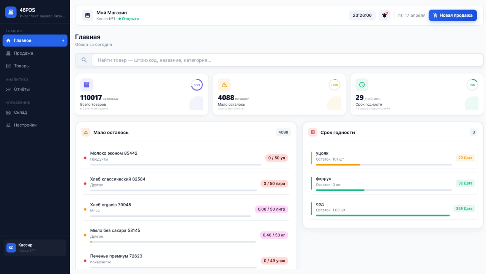 | 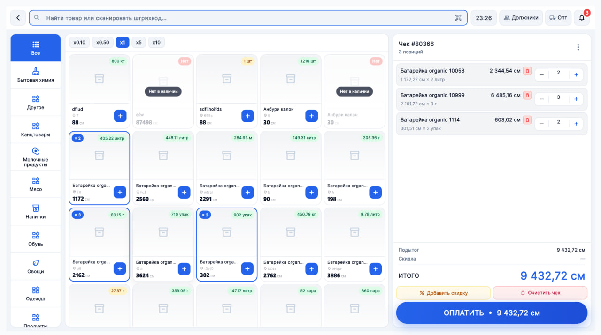 | 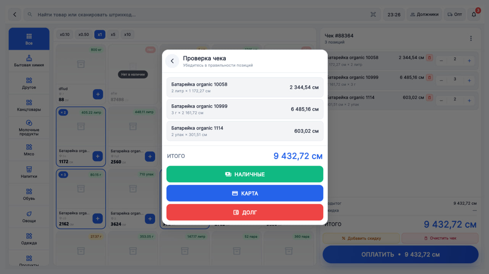 |

### Товары и склад
| Products | New Product | Warehouse |
| :---: | :---: | :---: |
| 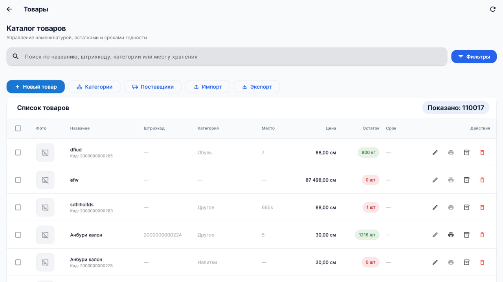 | 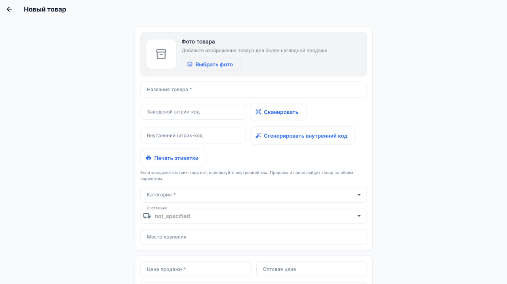 | 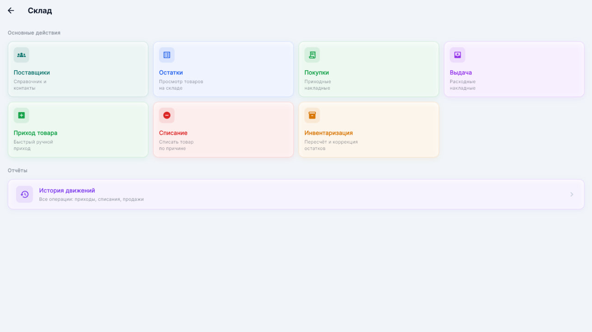 |

### Финансы и отчёты
| Expenses | Reports | Reports (альт) |
| :---: | :---: | :---: |
| 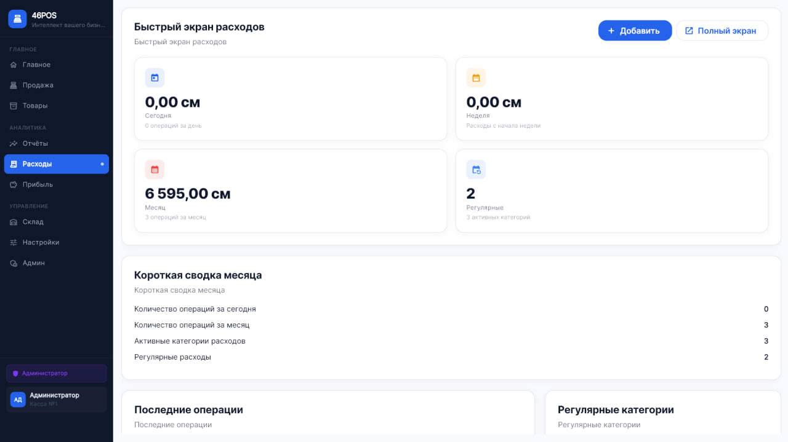 | 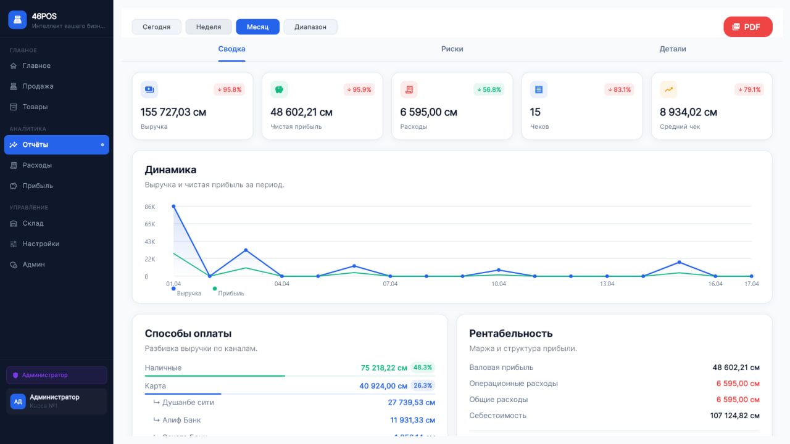 | 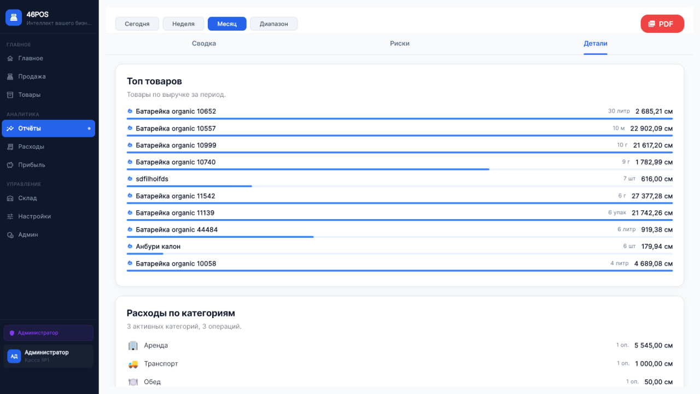 |

### Долги и операции с долгами
| Debts | Debt details | Close debt |
| :---: | :---: | :---: |
| 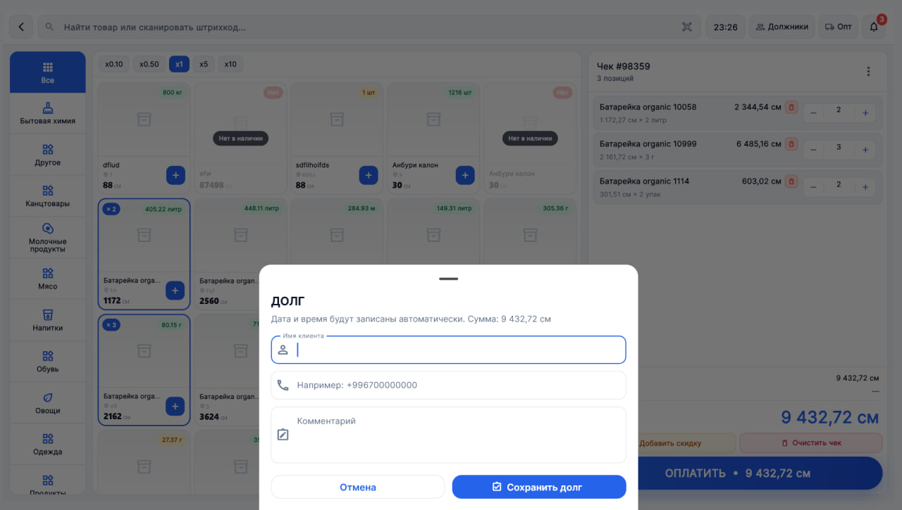 | 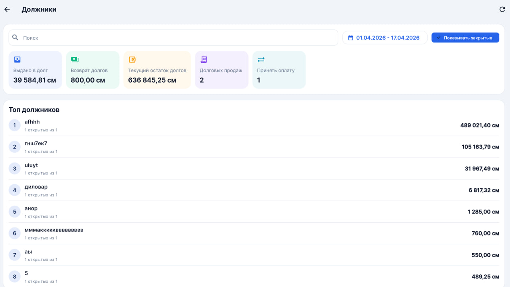 |  |

### Бэкап, настройки и печать
| Backup | Backup options | Label printing |
| :---: | :---: | :---: |
| 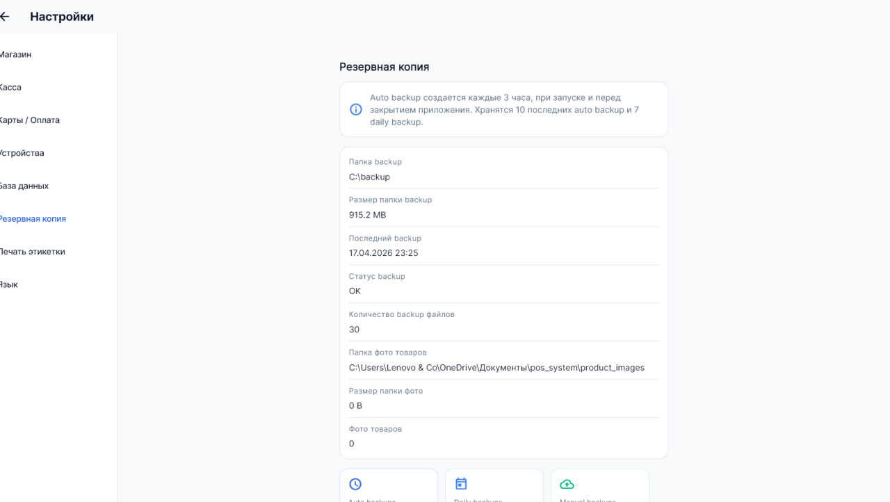 | 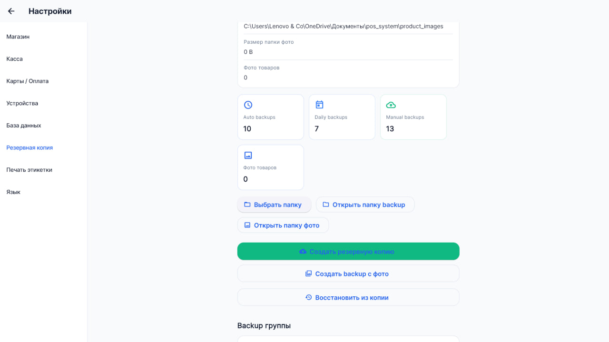 |  |

### Админ, настройки и доп. экраны
| Admin settings | Settings | App settings |
| :---: | :---: | :---: |
| 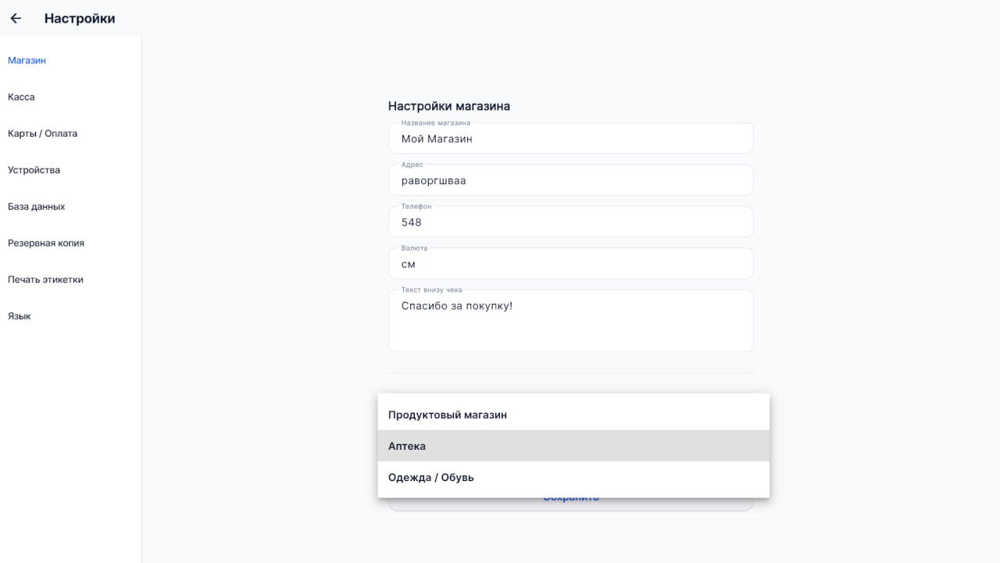 | 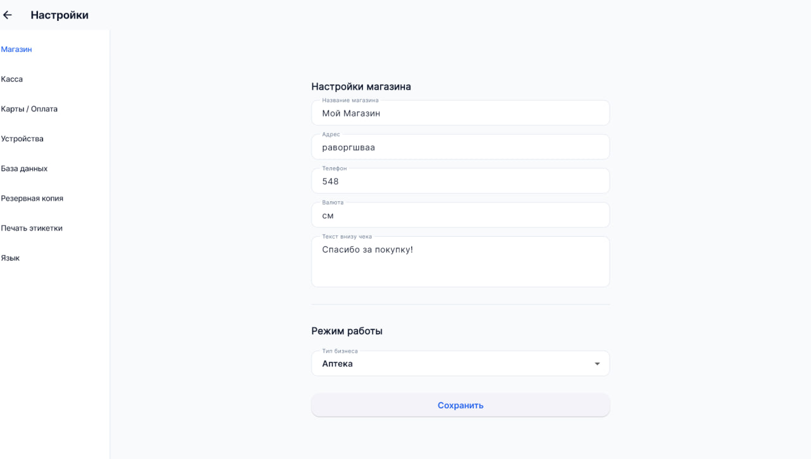 | 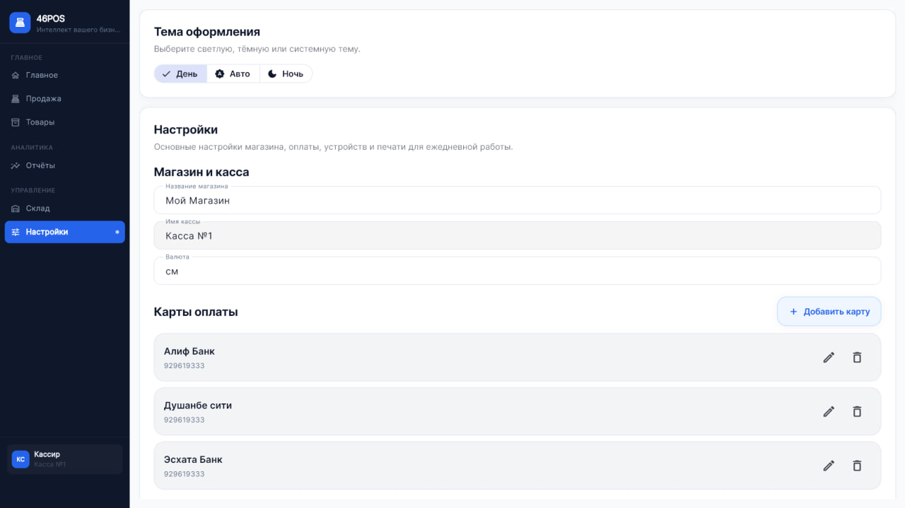 |

### Дополнительно (повтор/контекст)
| Sell (детали) |
| :---: |
|  |

---

## Локализация

Поддерживается: английский, русский, таджик (см. `l10n/`).

---

## Быстрый старт (если нужно собрать проект)

1. Установите Flutter (https://docs.flutter.dev).
2. В корне проекта выполните:

```bash
flutter pub get
flutter run
```

(Для Windows/Android/iOS — см. каталоги `windows/`, `android/`, `ios/` для дополнительных настроек.)

---

## Как добавить или изменить скриншоты

1. Поместите новые изображения в `assets/screenshots/`.
2. При необходимости обновите пути в этом файле `README_GITHUB.md`.

---

## Контакты и поддержка

**Shirinshoh Badalov** — вопросы и помощь по настройке:

[](https://t.me/shirinshoh)

---

Если хотите, могу:
- Сделать краткий `README.md` в корне (заменить текущий `README.md`).
- Оставить только 6–8 ключевых скриншотов и убрать повторы.
- Переписать подписи к изображениям в вашем стиле.

Напишите, что предпочитаете — сокращённый README в корень, или оставить этот демонстрационный файл.


---

## Описание функций (по разделам)

- **Продажи:** интерфейс быстрой продажи, поддержка частичной оплаты, возвратов и скидок.
- **Товары:** удобный каталог, карточки товара с фото/штрихкодом/прайсами.
- **Склад:** приём, списание, перемещения между складами, учёт остатков.
- **Долги / Расходы:** учёт задолженностей клиентов и оперативных расходов бизнеса.
- **Отчёты и финансы:** закрытие смены, отчёты по кассе, экспорт данных для бухгалтерии.
- **Пользователи:** роли и права доступа для безопасной работы кассиров и администраторов.
- **Инфраструктура:** локальная база данных, офлайн-режим, синхронизация при доступе в сеть.

---

